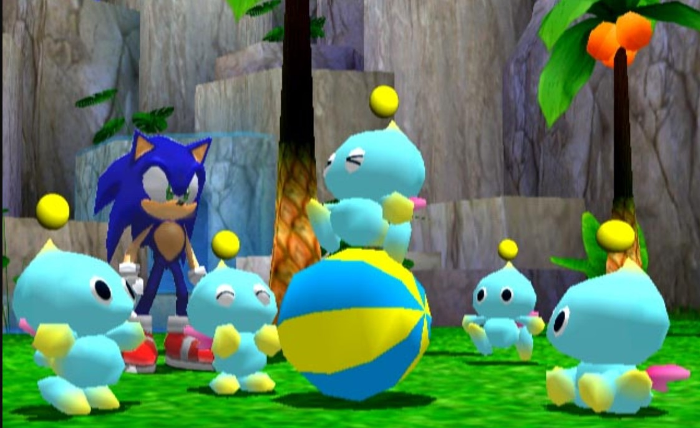

# Chao Engine
The first chao garden engine for roblox.

## Overview
This is a code framework for the Chao Garden as seen in Sonic Adventure 2. Its coded entirely in Luau with Roblox API. The goal of this is to be both a proof of concept, a showcase of the skills I've gained over the last few years and a fully functional game.

## Features
- Chao Eggs 
    - Throwing Eggs
    - Shaking Eggs
    - Carrying Eggs
    - Colored Eggs
- Chao
    - States (Check Notes in ReplicatedStorage)
    - Stat Generation
    - Aging
    - Multiple Chao
    - Colored Chao
    - Naming
    - Basic Chao Movement and States
    - Viewing stats
    - Picking up, petting and throwing
    - Feeding (Wisps, Chaos Drives, Fruits)
    - Changing appearance (WIP)
- Kindergarden
    - Black Market
        - Buying Items
    - Fortune Teller
        - Naming Chao
        - Randomized Names
    - Doctor
        - Talking to Doctor
        - Viewing Stats
    - Bulletin Board

## Planned Features
- Races
- Multiple Gardens
- Toys
- Daycare

# Contributing
Fork the project and make a pull request! Any and all help and advice are welcome.
